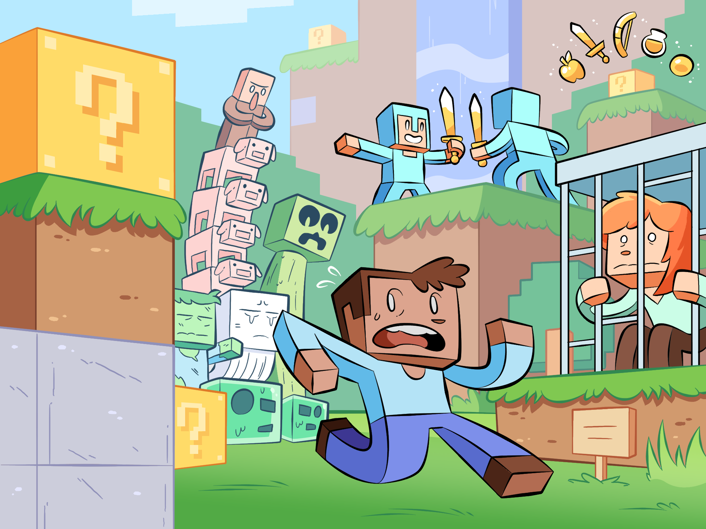
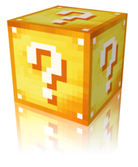
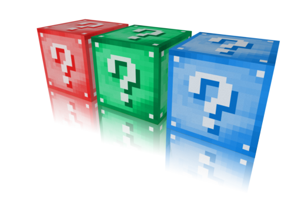

# Lucky Block

Originally created in 2015, the Lucky Block is a mod for Minecraft which has since gained over 5 million users. The mod adds a new block to the game which produces random outcomes, as well as items such as the lucky sword, bow and potion. Additionally, the mod can be customized with hundreds of community add-ons.

## Resources

- <a href="">Download Lucky Block</a>
- <a href="">Minecraft Forums</a>
- <a href="">Planet Minecraft</a>

## Installing
1. Download and install <a href="https://files.minecraftforge.net/">Minecraft Forge</a>, then run Minecraft at least once.
2. Download the Lucky Block and put it into your <a href="https://minecraft.gamepedia.com/.minecraft">.mincraft</a>/mods/</a> folder.
3. Run Minecraft and enjoy!

## Add-ons

### Installing
1. Install the Lucky Block and run Minecraft at least once.
2. Put add-ons into your <a href="https://minecraft.gamepedia.com/.minecraft">.mincraft</a>/addons/lucky_block/</a> folder.
3. Run Minecraft and enjoy!

## Copyright
Copyright © 2015 Alex Socha. All Rights Reserved.
By submitting a pull request, you agree to transfer all rights and ownership to the copyright holder.
